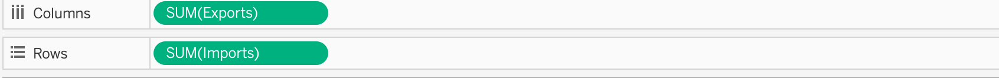

```{r setup, include=FALSE}
knitr::opts_chunk$set(echo = FALSE)
```

# 1. Critique of Visualisation
The original visualisation is created by using the same data for makeover 1 and is provided by Department of Statistics, Singapore (DOS). The data are available under the sub-section of [Merchandise Trade by Region/Market.](https://www.singstat.gov.sg/find-data/search-by-theme/trade-and-investment/merchandise-trade/latest-data)

{height="1000"}

### 1.1 Clarity
1. **Titles:** This visualisation does not contain title and provide any information about the data like what this data set is about. 

2. **Label of trade values** 
    + Though it states in the note that the size of the bubble reflects the total merchandise trade value with the trading partner, we don't know the period of the aggregated trade volume and if it's monthly, quarterly or yearly data. We can only infer it's data in year 2020 when refering it to the original data.

    + As each bubble takes up some space, it does not correspond to the x-axis and y-axis clearly like points. Readers cannot tell the exact volume of import and export.    

    + There're some overlaps between bubbles. The bubbles of some trading partners like EU, United States and Republic of korea are blocked by neighbouring bubbles.Therefore, readers are not able to see the white circle and which area it falls into. There's no way to tell whether those countries belong to net importers or net exporters.   

3. **Y-Axis and X-Axis** There's no indication of unit and currency in the x-axis and y-axis. 

4. **Information box** The insights in the information box compare data since 2006 and show the change point of net trade volume of Mainland China with Singapore and Unites States with Singapore separately. However, it does not match with the static graph which only presents one year's data. 

### 1.2 Aesthetic
1. **Colors** The graph used more than 10 colors. Colors are used to differentitate trading partners and do not encode values. Colors don't reflect any differences between trading partners and should be minimized. 

2. **Data Ink** Data ink are used in the graph. There're some unnecssary data ink like light blue backgroud color outside the chart and should be removed to emphasize the rest data ink. Same for the information box. For such findings or insights, creator could emphasize it through putting on the subtitles or annotations in the graph.

3. **Lengend** The legend of Top Net Exporter and Top Net Importer is placed at the bottom of the graph. Readers could not immediately understand the meaning of the two icons without scrolling down to the bottom part. 

4. **Annotation** Annotation with the trading partners and total trade values are too big and block bubbles representing the total trading values. 

# 2. Alternative Design
My proposed design is as follows.
{width=80%}

### 2.1 Clarity
1.  **Titles:**  Add interactive title with parameter top trading partners and filter year. When reader select certain year and the number of top trading partners they want to look at, title will update automatically to match with the data retrievd. 

2. **Label of trade values** 
    + Adding the year in the title and readers can see immediately from the title to know the periods of data. 
    
    + By adding total trade value, net trade value, imports and exports in the tooltip, readers can read all information in details when they hover on the bubble.
    
     + Using transparency and border color and avoid one bubble obscures the other. Use two color diverging scheme, readers can tell if it's a net exporter(blue) or net importer(red) from the color. They can also know the trade balance value from the darkness of the color. The darker the color, the larger the net trade balance. 

3. **Y-Axis and X-Axis** Add singapore dollars in the x and y axis.

4. **Information box** By adding slopgraph and comparing the change between 2011 and 2020. We can see the change from the graph and numbers directly. 

### 2.2 Aesthetic
1. **Colors**  Use only two colors to represent measures in each graph and each color represent different meaning. Red represents net importer and blue represents net exporter. 

2. **Data Ink** Remove background colors and unnecssary color inks. 

3. **Lengend** Shift the legend to the right top corner and make it more visible and easier to readers. 

4. **Annotation** Adding annotation in the subtitles and use colors to highlight important messages. 

# 3. Proposed Visualization
Please view the interactive visualisation on Tableau Public [**here.**](https://public.tableau.com/app/profile/zhang.ying7125/viz/Diz2/Dashboard1)
{width=80%}


# 4. Step-by-step Guide
| No     | Step | Action    |
| :---: | :----------------- | :------------------------------------------------- |
|1|  Unzip the output folder downloaded from the SingStat website. Load the outputFile excel file into Tableau Prep Builder. Check 'Cleaned with Data Interpreter' and drag the ‘T1’ worksheet containing imports data into main pane.     |  {height="300"} |
|2| Right click '+' sign beside T1 table and add 'Clean Step'. | {height="300"}|
|3| Select all columns except for Variables, 2011 Jan to 2020 Dec under Show list view.Click Rmove Fields.  | {height="300"}|
|4| Click '...' in Variables column and click **Custom Split**. Use the separator ( to spilt off First and Last. Create two new variables.| {height="300"}|
|5| Change two new variables names into Country and Unit. For Unit column, edit values and remove ). Remove the original column Variables. | {height="300"}|
|6| Creat Pivot table by clicking '+" beside Clean 1 step. Drag all columns with dates into **Pivot Fields**. | {height="300"}|
|7| Click '...' in Pivot 1 Values column and click **Custom Calculation**. Convert imports values into the same unit dollar and name this calculated field as Imports. | {height="300"}|
|8| Rename Column Pivot1 Names as Date. Remove Pivot1 Values and Unit columns | {height="300"}|
|9| Repeat the steps from 2 to 8 for working sheet T2. Drag Pivot 1 into Pivot 2 and join two tables. | {height="300"}|
|10| Add Join caluses "Country = Country" and "Date = Date". Choose Inner join as the join type. | {height="300"}|
|11| Remove dupliacted columns Date-1 and Country-1. | {height="300"}|
|12| Generate Output after cleaning the data set. Click **Browse** and locate the correct folder. Run flow and save this new file in hyper format. | {height="300"}|
|13 |Open Tableau Desktop and load the saved hyper file. Click **Filter** on the right top corner and Add filter. Uncheck 5 Regions and Click **OK**. Click Date dropdown list and change data type from string to date.| {height="300"}|
|14 |Click sheet 1 and rename it as 'Bubble Chart'. Drag Exports to columns and Imports to Rows. | {width="500"}|
|15| Click **Create Calculated Fields** under **Analysis** tab. Create a new column called Net Trade Balance using the formula on the right side. Repeat the same step and create another column called Total by changing the formula to '[Exports] + [Imports]'. | {width="500"}|
|16| Drag Net Trade Balance to **Color**. Adjust Opacity to 75% and change border color to grey. Drag Total to **Size** and move the cursor to the right. Drag Country to **Detail**.| {width="500"}|
|17|Click **Edit Colors** in the color legend. Choose Red-Blue Diverging and set center to 0. | {width="500"}|
|18| In the Data pane, click the drop-down arrow in the upper right corner and select **Create Parameter**. Choose **Top** tab and name the parameter as Top Trading Partners. Set the range from 1 to 15 and step as 1.| {height="300"}|
|19| In the Data pane, right click Country and choose **Create Set**. Renmae this set asTop N Trading Partners by total trade volume. Choose **Top** and **By field** by Total SUM.  | {height="300"}|
|20| Drag Date from Data Panel to **Filters** shelf. Click "Year" and select all years.Drag Top N Trading Partners by Total Trade Value to **Filters**. | {height="300"}|
|21| Click YEAR(Date) Filter dropdown list and choose **Show Filter**. Change filter to Singlae Value (list). | {height="300"}|
|22 | Create two calculated fields Net Importer and Net Expoter.| {width="500"}|
|23 | Drag Total, Net Exporter and Net Importer into **Label**. Click format in Total and change Display unit to Billons (B) in Currency(Custom). Set Decimal places as 2. Change Fields to Net Exporter and Net Importer and change to the same number format.| {height="300"}|
|24 | Click any place in the main graph pane and choose format. Select None for the Grid Lines. | {height="300"}|
|25 | Double clikc the title and edit the title to an interactive one by inserting paramter Top Trading Partners and filter YEAR(Date). | {width="500"}|
|26 | Click **Tooltip** and edit it as the picture shown on the right. Use different colors to represent various measures  | {width="500"}|
|27 | Drag YEAR(Date) to the **Pages** shelf. On the top of the working sheet, click **Format** and select **Animations**. Turn on the Animations effect and change the duration to Medium. | {height="300"}|
|28 | Creat a new working sheet and name it as Slopegraph. Creat a new parameter called 'Select' and add a list of values from Imports to Net trade value. |{width="500"}|
|29 | Click 'Select' and create calculated value "Selected" using the formuala on the right.  | {height="300"}|
|30 | Create four calculated fields Delta, Delta percent, Magnitude and Direction. | {height="300"}|
|31 |  Drag YEAR(Date) into Columns and Selected into Rows. | {width="500"}|
|32 | Drag Direction into **Color** shelf and change Decreased to red and Increased to blue. |{height="300"}|
|33|  Drag Magnitude into **Size**, Country and Delta percent into **Label** and Country into **Detail**. Right click **Label** and edit it to Country, Delta percent %.  | {width="500"}|
|34 | Drag Top N Trading Partners by total trade value and YEAR(Date) into Filters shelf. Select year 2011 and year 2020. Add graph title. | {height="300"}|
|35 | Creat Dashboard 1 and drag two sheets Bubble Chart and Slopgraph into the blank pane. | {height="300"}|
|36 | Delete Year filter and Magnitude legend beside the slopegraph. | {height="300"}|
|37 | Click **Actions..**  under **Dashboard** tab. Add action Highlight. Choose Hover and Target Highlighting Selected Fields Country to link two sheets. | {height="300"}|
|38 | Add main title and findings. | {width="500"}|


# 5. Derived Insights
1. **Mainland China** China has increased 33.9% from 2011 to 2020 in terms of total trade value with 35.9% increase in imports and 32% increase in exports. If playing the animations, it can be found that it has always been net exporter in blue color for 10 years. Net trade balance dropped to the lowest point S$1 Billion which is grey in year 2018. It exceeded Malaysia and became the top 1 trading partner in 2013.Though the total trade value increased positively, the growth rate ranks only number 3 and it's lower than United States(35%) and Taiwan(64.6%).
{width=80%}

2.**Hongkong** has been top 1 net exporter since 2011 and exports value kept in the range between 55 billions and 65 billions Singapore dollars which is relatively stable. It has replaced Indonesia and became the second largest trading partner Singapore exporting to. 

3. **Taiwan** Taiwan's trade with Singapore has grown exponentially in the past 10 year and has been the top 1 net importer in 2020. The total trade value increased 64.6% and imports increased 83.1% which is the highest among all trading partners. 

4. **Indonesia and Malaysia** Indonesia and Malaysia used to be among top 3 net exporters with Singapore. However, both exports values droppped significantly with 48.1% and 28.4% respectively. Malaysia has change from net exporter to net importer since 2019. 
{width=80%}

5. **United States** United States has also experienced fast growth in trade with Singapore with 35% increase in total trade value. It catched up with European Union and exceeded EU in 2019. What's interesting is the net trade balance in 2020 which exports exceeded imports. Before 2020, United States has always been a net exporter. 

