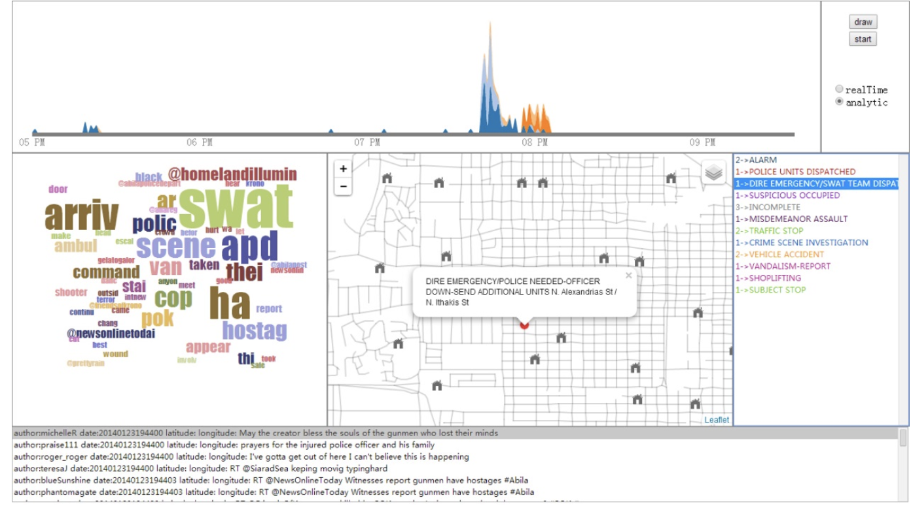
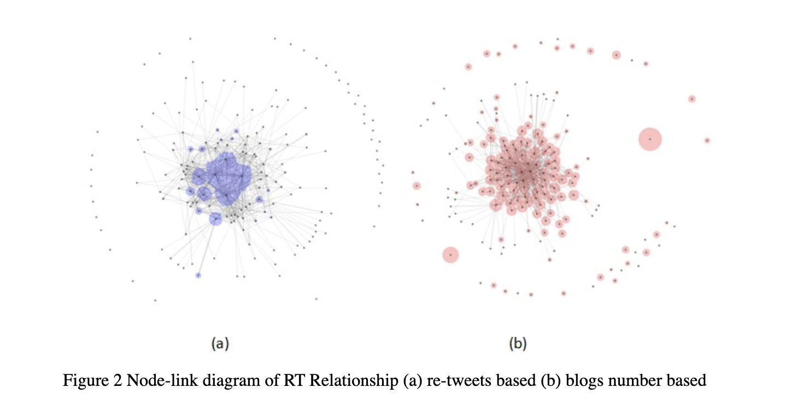
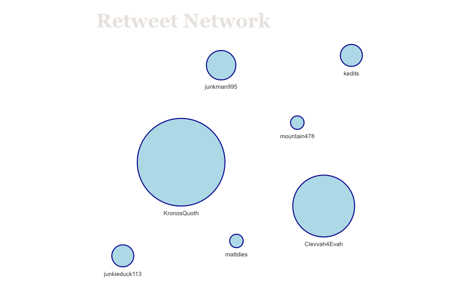
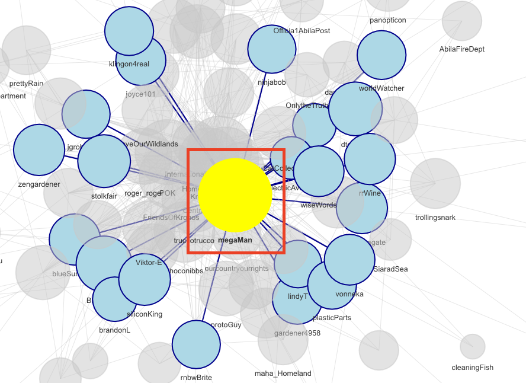
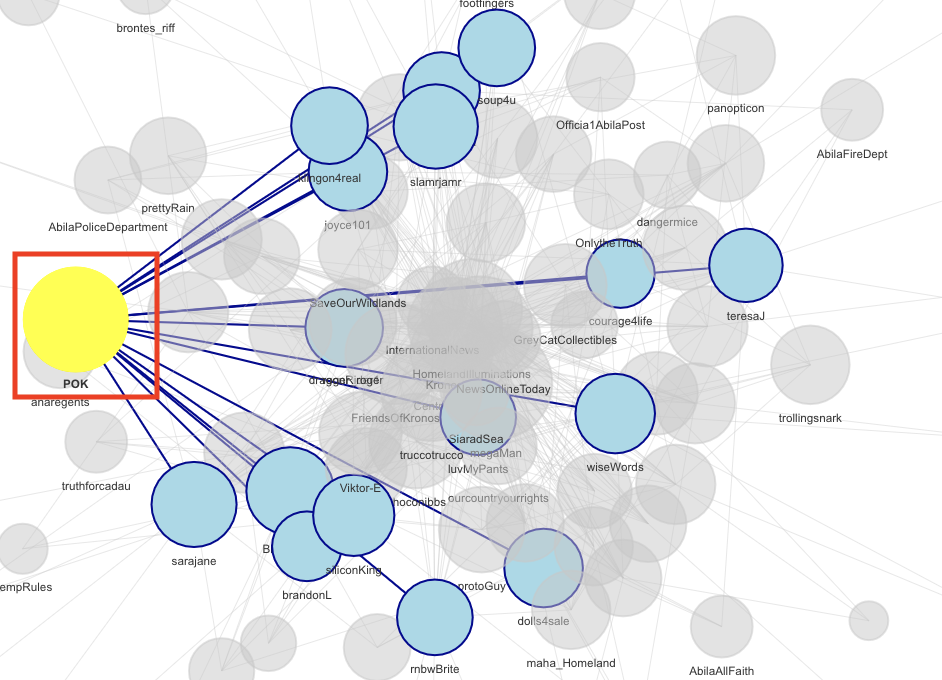
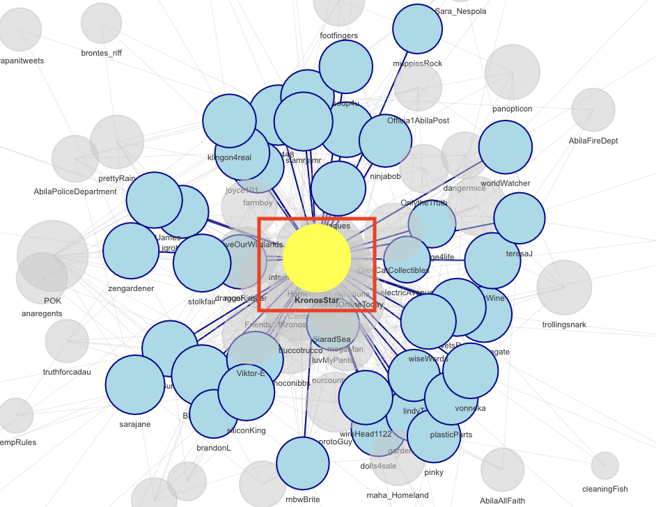

```{r setup, include=FALSE}
knitr::opts_chunk$set(fig.retina=3,
                      echo = TRUE,
                      eval = TRUE,
                      message = FALSE,
                      warning = FALSE)
```

# 1.0 Background

### 1.1 Vast Challenge 2021

The 2021 IEEE VAST Challenge is an international visual analytics competition and it brings back a classic challenge to see how approaches and techniques have developed since its original release. This year’s challenge will be a variation on a previous year’s challenge, with modified data and new questions.

[Vast Challenge 2021](https://vast-challenge.github.io/2021/)

In the roughly twenty years that Tethys-based GAStech has been operating a natural gas production site in the island country of Kronos, it has produced remarkable profits and developed strong relationships with the government of Kronos. However, GAStech has not been as successful in demonstrating environmental stewardship.

In January, 2014, the leaders of GAStech are celebrating their new-found fortune as a result of the initial public offering of their very successful company. In the midst of this celebration, several employees of GAStech go missing. An organization known as the Protectors of Kronos (POK) is suspected in the disappearance, but things may not be what they seem.

As an expert in visual analytics, you are called in to help law enforcement from Kronos and Tethys.

### 1.2 Mini Chanllenge 3 

Mini-Challenge 3 poses a social media and text analysis challenge. We will be given a collection of microblogs and emergency calls from the days surrounding the disappearance. Based on two datasets, we will evaluate the changing levels of risk to the public and recommend actions.

On January 23, 2014, multiple events unfolded in Abila. You’ve been asked to come in to perform a retrospective analysis based on limited information about what took place. Your goal is to identify risks and how they could have been mitigated more effectively.

You have access to a single data stream containing two major sources:

Microblog records that have been identified by automated filters as being potentially relevant to the ongoing incident
Text transcripts of emergency dispatches by the Abila, Kronos local police and fire departments.

### 1.3 Tasks and Questions:

1.Using visual analytics, characterize the different types of content in the dataset. What distinguishes meaningful event reports from typical chatter from junk or spam? Please limit your answer to 8 images and 500 words.

2.Use visual analytics to represent and evaluate how the level of the risk to the public evolves over the course of the evening. Consider the potential consequences of the situation and the number of people who could be affected. Please limit your answer to 10 images and 1000 words.

3.If you were able to send a team of first responders to any single place, where would it be? Provide your rationale. How might your response be different if you had to respond to the events in real time rather than retrospectively? Please limit your answer to 8 images and 500 words.

4.If you solved this mini-challenge in 2014, how did you approach it differently this year?

# 2.0 Literature Review 
[Vast Challenge 2014-Tianjin University](http://visualdata.wustl.edu/varepository/VAST%20Challenge%202014/challenges/MC3%20-%20Real-Time,%20Streaming%20Social%20Media/entries/Tianjin%20University/)

This is the same competition as in 2014 and we will review those winning projects before doing the analysis. Below analysis is mainly conducted on 

### 2.1 Real time social media analysis

This interface combined statistical analysis(bar chart), text analysis(word cloud) and geospatial analysis(maps) together. It marked all call center data in the map and categorised risks levels  by colours. When changing time, both microblogs and call centers data will be shown. This gives a full picture of things. In R, we can present most frequent word using wordcloud and microblogs data using DT table. We can also draw maps using tmap. We need to think about how to combine different graphs, tables and data in maps together and provide realTime feedback. 

{width=400}

### 2.2  Network analysis

This project adopted network analysis which can be used to detect the relationships of the re-tweets.From the network graphs, we can filter out those spam/junk tweets accounts which are ignored by other users. It can also help us to find out influential tweets accounts containing meaning information. In the R, package visNetwork is a powerful tool that can serve the same purpose. The good thing about this package is it's able to plot interactive graphs. It means that by clicking on the nodes, we can detect sub-networks and the relationships among the smaller social network community. 

{width=400}


# 3.0 Data Preporcessing

### 3.1 Download R pakcges 

```{r}

packages = c("tm","textclean",'clock',
             "lubridate","hms","tidyverse",
             'raster','sf','tmap','rgdal',
             "tidytext","widyr","wordcloud",
             "DT","ggwordcloud","textplot",
             "tidygraph","ggraph","igraph",
             "viridisLite","mapview",
              "greekLetters","visNetwork")
for (p in packages){
  if(!require(p,character.only = T)){
    install.packages(p)
  }
  library(p,character.only = T)
}
```

### 3.2 Import Data

As 3 csv data files are in the same data format, we can download and combine it into one dataset called all_events.

```{r}
events_1 <- read_csv("data/csv-1700-1830.csv")
events_2 <- read_csv("data/csv-1831-2000.csv")
events_3 <- read_csv("data/csv-2001-2131.csv")
all_events <- bind_rows(events_1,events_2)
all_events <- bind_rows(all_events, events_3) 

glimpse(all_events ) #dbl: double class,hold numeric values with decimal points

```

### 3.3 converting Data-Time Field

After checking the data types, we found that column date is in double class and need to convert to timestamp format. 

```{r}
all_events$`date(yyyyMMddHHmmss)`  <- ymd_hms(all_events$`date(yyyyMMddHHmmss)`)
colnames(all_events)[2] <- "time"

glimpse(all_events )
```

### 3.4 Create sub data sets 

Create sub data mbdata and ccdata from the dataset. 

```{r}
mbdata <- all_events[all_events$type=="mbdata",] #3872 observations
ccdata <- all_events[all_events$type=="ccdata",] #191 observations

mbdata$time_30min = cut(mbdata$time, breaks="30 min")
ccdata$time_30min = cut(ccdata$time, breaks="30 min")
```

### 3.5 Text Data Cleaning

Clean the microblogs data using text analysis techniques. Remove retweets, mentions and hashtags to retreive the actual messgaes. 

```{r}
retweets <- "RT @([A-Za-z]+[A-Za-z0-9_-]+)(?![A-Za-z0-9_]*\\.)"
mentions <- "@([A-Za-z]+[A-Za-z0-9_-]+)(?![A-Za-z0-9_]*\\.)"
hashtags <- "#([A-Za-z]+[A-Za-z0-9_]+)(?![A-Za-z0-9_]*\\.)"
  
mbdata$cleaned <-  mbdata$message %>%
  replace_contraction()%>%
  str_replace_all(retweets ,"") %>% # remove retweets
  str_replace_all(mentions,"") %>% # remove mentions 
  str_replace_all(hashtags,"") %>% # remove hashtags
  str_replace_all("[0-9]", "")%>% # remove all numbers 
  str_replace_all("[,\\.=!?$+%-&<>;:-]","")%>% # remove all punctuations
  str_replace_all("�","")%>% # removes unicode replacement character
   # expand contracted words
  tolower()%>% #change characters to lower case
  removeWords(stopwords("english"))
```

Relabel messages in call center (cc data) and combine similar messages into the same categories. It'll easier to gain useful insights. 

```{r}
ccdata$cleaned <- ccdata$message %>%
  str_replace_all("ALARM-SECURE NO CRIME","ALARM") %>%
  str_replace_all("INCOMPLETE CALL FOR POLICE","INCOMPLETE") %>% 
  str_replace_all("DISTURBANCE-NOISE","NOISE")%>% 
  str_replace_all("MISDEMEANOR ASSAULT-IN PROGRESS","MISDEMEANOR ASSAULT")%>% 
  str_replace_all("VEHICLE ACCIDENT - NO OR UNKNOWN INJURIES","VEHICLE ACCIDENT") %>%
  str_replace_all("VEHICLE ACCIDENT - REPORT","VEHICLE ACCIDENT") %>%
  str_replace_all("VEHICLE ACCIDENT-REPORT","VEHICLE ACCIDENT") %>%
  str_replace_all("SUSPICIOUS OCCUPIED VEHICLE-BLACK VAN","BLACK VAN") %>%
  str_replace_all("CRIME SCENE INVESTIGATION REQUEST-[A-Z/[:space:]]*","CRIME SCENE INVESTIGATION")%>%
  str_replace_all("CRIME SCENE INVESTIGATION-REQUEST[-A-Z/[:space:]]*","CRIME SCENE INVESTIGATION")%>%
  str_replace_all("SUSPICIOUS SUBJECT/CIRCUMSTANCES-IN PROGRESS*","SUSPICIOUS SUBJECT/CIRCUMSTANCES")%>%
  str_replace_all("FIRE/MEDICS NEEDED-AMBULANCE DISPATCHED[ TO FIRE]*","FIRE AMBULANCE DISPATCHED")%>%
  str_replace_all("FIRE/MEDICS NEEDED-AMUBLANCE DISPATCHED TO FIRE","FIRE AMBULANCE DISPATCHED")%>%
  str_replace_all("FIRE/MEDICS NEEDED-FIRE TRUCK[-A-Z/[:space:]0-9#]*","FIRE TRUCKS DISPATCHED")%>%
  str_replace_all("FIRE/MEDICS NEEDED-FIRE TRUCK[-A-Z/[:space:]0-9#]*","FIRE TRUCKS DISPATCHED")%>%
  str_replace_all("FELONY HIT & RUN[-A-Z[:space:]]*","HIT & RUN")%>%
  str_replace_all("FIRE/MEDICS DISPATCHED-PEDESTRIAN HIT & RUN","HIT & RUN")%>%
  str_replace_all("PURSUIT[-/#0-9A-Z[:space:]]*","PURSUIT")%>%
	str_replace_all("POLICE NEEDED-POLICE UNITS #101 AND #220 DISPATCHED TO FIRE","POLICE UNIT DISPATCHED")%>%
  str_replace_all("POLICE UNIT DISPATCHED-CROWD CONTROL","POLICE UNIT DISPATCHED")%>%
  str_replace_all("POLICE UNITS DISPATCHED","POLICE UNIT DISPATCHED")
```


# 4.0 Visual analytics 

### 4.1 Initial EDA

By counting the frequency of tweets for individual users, we can identify active tweets users like KronosQuoth, Clevvah4Evah, megaMan, AbilaPost and POK. They posted a lot of tweets but it may include retweets from other users. We need further analysis to see if they create original messages or just repost other people's tweets.

```{r}
mbdata_count <- mbdata%>%
  group_by(author)%>%
  count()%>%
  arrange(desc(n))

mbdata_count%>%
  filter(n>30)%>%
  ggplot(aes(x=reorder(author,n), y=n)) +
  geom_bar(stat='identity') +
  coord_flip()+
  ggtitle("Number of Tweets by users")+
  xlab("User Name") + ylab("Number of Tweets")+
  theme_classic()+
  geom_col(fill="lightblue")+
  geom_text(aes(label = n),hjust=1,colour = "white",size=3)+
  theme(plot.title = element_text(hjust = 0.5))
```

Similarly, we plotted the barchart using ccdata. After first glance, we roughly know that traffic stop is most frequent reported calls. We also receive a lot of calls regarding alarm, subject stop and suspicious subjects apart from incomplete calls. 

```{r,fig.width=10, fig.height=8}
ccdata_count <- ccdata%>%
  group_by(cleaned)%>%
  count() %>%
  arrange(desc(n))

ggplot(ccdata_count,aes(x=reorder(cleaned,n), y=n)) +
  geom_bar(stat='identity') +
  coord_flip()+
  ggtitle("Number of calls by Incident type")+
  xlab("Number of calls") + ylab("Incident type")+
  theme_classic()+
  geom_text(aes(label = n),hjust=1,colour = "white",size=4)+
  theme(plot.title = element_text(hjust = 0.5))
```


### 4.2  Text Analytics 

After looking at the data from an aggregated level, we need to evaluate the level of the risk to the public over the course of the evening. Firstly, we divide data into 10 classes from 17:00-21:30 by 30 mins time interval. 

```{r}
cleaned_mbdata <- mbdata%>%
  select("time_30min","cleaned")

usenet_words <- cleaned_mbdata %>%
  unnest_tokens(word, cleaned, token = "tweets")%>%
  filter(!word %in% stop_words$word,
         length(word)>1)%>% 
  group_by(time_30min) %>% 
  count(word)%>% 
  arrange(desc(n))%>% 
  ungroup()
```

Then, we can tokenize words using cleaned messages after data cleaning and generate a wordcloud to check on the most frequent word in social media. From the wordcloud, we can guess some of the important incidents in this evening: dolphin fire, rally, shoots, and van. 

```{r}
set.seed(1234)

wordcloud(words = usenet_words$word, 
          freq = usenet_words$n,
          max.words=200,random.order = FALSE,
          rot.per = 0.3,
          colors = brewer.pal(8,"Dark2"))
```

Using facet_wrap function, we can draw wordcloud for every 30mins and roughly map the incidents with the time. 

17:00 to 18:00: POK rally;
18:30 to 21:30: Dolphine fire;
19:30 to 20:00: shooting;
19:30 to 21:30: Van.

```{r,fig.width=6, fig.height=5}
set.seed(1234)

usenet_words %>%
  group_by(time_30min) %>% 
  slice_max(order_by = n, n = 20) %>% 
ggplot(aes(label = word,
           size = n)) +
  geom_text_wordcloud() +
  theme_minimal() +
  facet_wrap(~time_30min)

```

As the wordcloud just list the most frequent words in different timeintervals and didn't give us specific information. We need to use bigrams to collect more details. 

```{r}
bigrams <-cleaned_mbdata %>%
  group_by(time_30min)%>%
  unnest_tokens(word, 
                cleaned, 
                token = "ngrams", 
                n = 2) %>%
  count(time_30min,word, sort = TRUE)
```

With the bigrams, we can infer the following information: 

17:00 to 18:00: POK rally - rally's leader is sylvia and it could be peaceful though got police intervened. 
18:30 to 21:30: Dolphine fire - fire was in dolphine department and fire trucks and firefighters were dispatched. 
19:30 to 20:00: shooting - gun fire could possibily started between 19:30 and 20:00. 
19:30 to 21:30: Van - not much information. 

```{r,fig.width=12, fig.height=10}
tf_idf <- bigrams%>%
  bind_tf_idf(word,time_30min, n) %>%
  arrange(desc(tf_idf))

tf_idf %>%
  group_by(time_30min) %>%
  slice_max(tf_idf,
            n = 10) %>%
  ungroup() %>%
  mutate(word = reorder(word,
                        tf_idf)) %>%
  ggplot(aes(tf_idf,
             word,
             fill = time_30min)) +
  geom_col(show.legend = FALSE) +
  facet_wrap(~ time_30min,
             scales = "free") +
  labs(x = "tf-idf bigram",
       y = NULL)

```

Another way to investigate the risk levels over time is to plot the number of events including microblogs and emergency calls over time. From the graph, we can detect a few active time periods with high frequency. The peaks of two types of events are observed during time interval 18:40-18:55, 19:40-19:50 and 20:10:00.

```{r}
all_events$time_1min <- cut(all_events$time, breaks="1 min")
# convert time as hour+minutes
all_events$time_1min <- ymd_hms(all_events$time_1min)

counts <- all_events %>%
  group_by(type,time_1min) %>%
  summarise(count = n_distinct(message))

ggplot(counts,
       aes(x=time_1min,
           y=count,
           group=type))+
  geom_line(aes(color=type))+
  ggtitle("Total Number of Events Over Time")+
  xlab("Time") + ylab("number of tweets or calls")+
  theme(axis.text.x = element_text(angle = 90, hjust = 1))+
  theme(plot.title = element_text(hjust = 0.5))

```

For the above abnormal time periods, we can check the call center messages by plotting a DT table to see if any unusal things were reported. With the time filter, we can find that a few people reported fire at 18:40pm and fire trucks were dispatched immediately after it. From 19:40 to 19:50, many reports were linked with black van and they were reported in different locations. It may give some clues on the escape traces of the black van.  

```{r}
ccdata$time_1min <- cut(ccdata$time, breaks="1 min")
cc_table <- ccdata[,c("time_1min","cleaned","location")]
cc_table$time_1min <- ymd_hms(cc_table$time_1min)
cc_table$time_1min <- format(cc_table$time_1min,"%H:%M")

DT::datatable(cc_table,filter="top")%>%
  formatStyle(0,target='row',lineHeight='25%')
```


### 4.3 Network analysis

In the first part initial EDA, we only count the number of tweets per user. Many of them reposted other people's tweets and should be considered as spams/junk messages. In order to study the relationships between different users and detect meaningful messages, we could draw interactive retweets network graph using visNetwork package. By constructing retweet network oject with edges and nodes, we can know those influential users who are usually retweeted by other users and those users who tweeted a lot while are not quoted by other users. With this interactive graph, we can also identify network communities by clicking the users who are at the center of the network. 


```{r}
# Retrieve Retweet data from message by using regex 

retweets <- "RT @([A-Za-z]+[A-Za-z0-9_-]+)(?![A-Za-z0-9_]*\\.)"
regex <- "@([A-Za-z]+[A-Za-z0-9_-]+)(?![A-Za-z0-9_]*\\.)"
regex2 <- "RT @([A-Za-z]+[A-Za-z0-9_-]+)(?![A-Za-z0-9_]*\\.) "
mentions <- "@([A-Za-z]+[A-Za-z0-9_-]+)(?![A-Za-z0-9_]*\\.)"
hashtags <- "#([A-Za-z]+[A-Za-z0-9_]+)(?![A-Za-z0-9_]*\\.)"

all_events$RT_pattern <-str_extract_all(all_events$message, retweets, simplify = TRUE)
all_events$RT_from<-  str_extract_all(all_events$RT_pattern, regex, simplify = TRUE)
all_events$RT_from<-  str_replace(all_events$RT_from, "@","")
all_events$RT_message <- str_replace_all(all_events$message,regex2,"")

data_RT<- all_events %>% 
  filter(RT_from!="")

# create network edges and nodes data
RT_edges <-data_RT%>%
  group_by(RT_from,author) %>%
  count() %>%
  ungroup()

RT_nodes <-all_events%>%
  group_by(author) %>%
  count() %>%
  ungroup

RT_nodes$id<-seq.int(nrow(RT_nodes))
RT_nodes <-RT_nodes %>% 
  rename(label=author,size=n) %>% 
  filter(label!="")

RT_nodes$size<-RT_nodes$size+1
RT_nodes$size<-log2(RT_nodes$size)*10

RT_edges_viz<-
  left_join(RT_edges,RT_nodes,by=c("RT_from"="label")) %>% 
  rename(from=id) %>% 
  left_join(RT_nodes,by=c("author"="label")) %>% 
  rename(to=id)

RT_edges_viz<-subset(RT_edges_viz,select=c("from","to"))

RT_graph <- tbl_graph(nodes=RT_nodes,edges = RT_edges,
                           directed = TRUE)

visNetwork(RT_nodes, 
            RT_edges_viz , 
            main = "Retweet Network",width="100%", height="400px")%>%
   visOptions(highlightNearest = TRUE)%>%
   visNodes(label="label",color = list(background = "lightblue", 
                        border = "darkblue",
                        highlight = "yellow"))%>% 
  visIgraphLayout(layout = "layout_with_fr")
```

Comparing this network graph with the bar chart in section 4.1, we can find that KronosQuoth and Clevvah4Evah (top 1 and 2 who posted tweets) are at the edge of the network and don't have any link with other users. We can exclude them from our analysis. megaMan and POK has some influence in their respective networks. KronosStar, Homeandilluminations and some media accounts (e.g. AbilaPost and NewsOnlineToday) are more influential tweets users and their messages could be more meaningful. 

{width=80%}

{width=80%}

{width=80%}

{width=80%}

### 4.4  Maps 

Combined analysis in section 4.1 and 4.2. We identified three incidents that are dangerous: fire, shooting and black van escape. For the three events, shooting is the most risky and may influence many people. I will deploy the first respondent to location  N. Alexandrias St / N. Ithakis St at around 19:40 based on the call center report.

However, if it's real time, i will need to check on the frequency of activities and social media contents to filter suspicious events. Thne locate the place based on the location of message. 

```{r}
Abila_st <- st_read(dsn="data/Geospatial",
                    layer = "Abila")

data_location <- all_events %>% 
  filter(longitude!="" ) %>% 
  add_count(longitude,latitude,author)

p = npts(Abila_st, by_feature = TRUE)

Abila_st <- cbind(Abila_st, p) %>%
  filter(p>1) 

gps_sf<-st_as_sf(data_location,
                   coords = c("longitude","latitude"),
                  crs= 4326)

gps_sf2<-subset(gps_sf,select = c(time,author,message,geometry))

gps_sf2<- gps_sf2 %>% filter(str_detect(gps_sf2$message,"shooting"))

gps_sf2<-gps_sf2%>% mutate_if(is.character, ~gsub('[^ -~]', '', .)) # remove characters non UTF-8


tmap_mode("view") 

tm_shape(Abila_st)+
  tm_lines()+
  tm_shape(gps_sf2)+
  tm_dots()+
  tm_layout(title= 'Risk place identified by Microblogs containing shooting')

```

